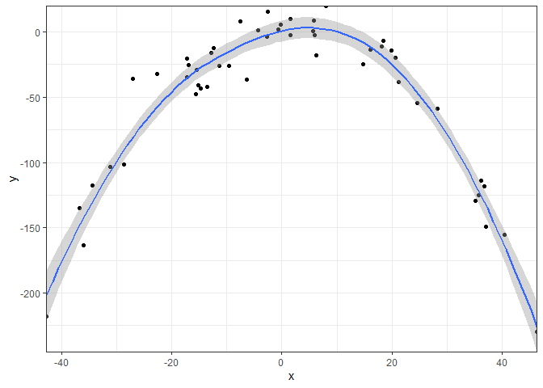

``` r
library(ggplot2)
```

```
## Warning: package 'ggplot2' was built under R version 4.2.3
```


``` r
print("This is a test of print()")
```

```
## [1] "This is a test of print()"
```


``` r
data <- data.frame(x = rnorm(50, 3, 23))
data$y = .3*data$x - .1*data$x^2 + rnorm (50, 0, 15)

ggplot(data, aes(x,y)) +
  geom_point() +
  stat_smooth() +
  coord_cartesian(expand = FALSE) +
  theme_bw()
```

```
## `geom_smooth()` using method = 'loess' and formula = 'y ~ x'
```

<!-- -->
